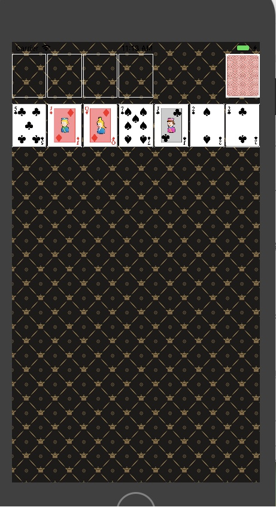
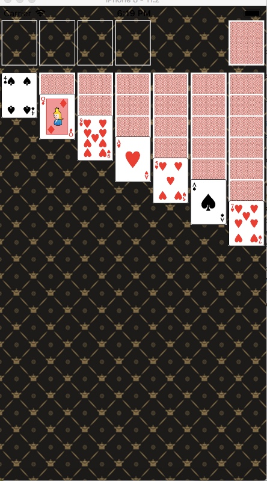
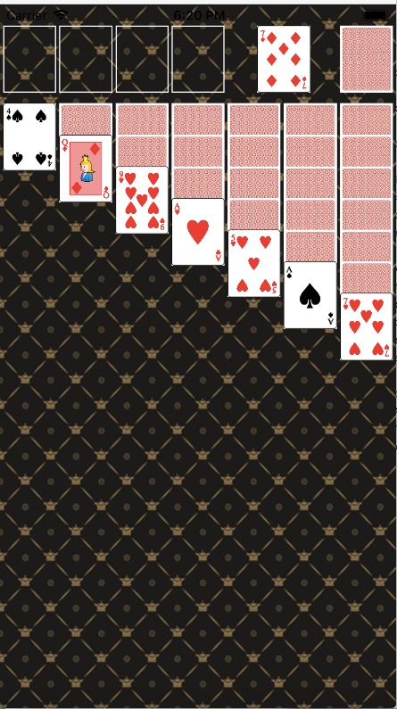
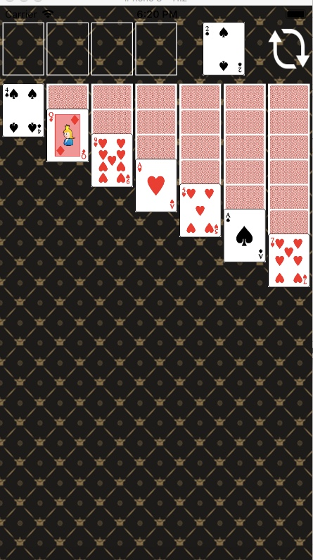

## 카드게임 앱

### step-1

#### 요구사항

- 앱 기본 설정을 지정해서 StatusBar 스타일을 LightContent로 보이도록 한다.
- ViewController 클래스에서 self.view 배경을 다음 이미지 패턴으로 지정한다. 이미지 파일은 Assets에 추가한다.
- ViewController 클래스에서 코드로 아래 출력 화면처럼 화면을 균등하게 7등분해서 7개 UIImageView를 추가하고 카드 뒷면을 보여준다.
- 카드 가로와 세로 비율은 1:1.27로 지정한다.

#### 실행 화면

### step-2

#### 실행화면

### step-3

#### 실행화면

#### step-4

#### 뷰 컨트롤러 초기화

- init(nibName:bundle:)

  지정된 이니셜라이저이다. 뷰 컨트롤러를 정의하기 위해 스토리보드를 사용할 때, 뷰 컨트롤러를 직접 초기화하지 않는다. 

  대신, 뷰 컨트롤러는 segue에 의해 자동적으로 혹은 스토리보드 객체의 메소드인 instantiateViewController(withIdentifier:)을 호출할 때 프로그램에 따라 스토리보드에 의해 초기화된다.

  스토리보드로 뷰 컨트롤러를 초기화 할 때, iOS는 이 메소드 대신 init(coder:)를 호출하면서 새로운 뷰 컨트롤러를 만든다.

  ​